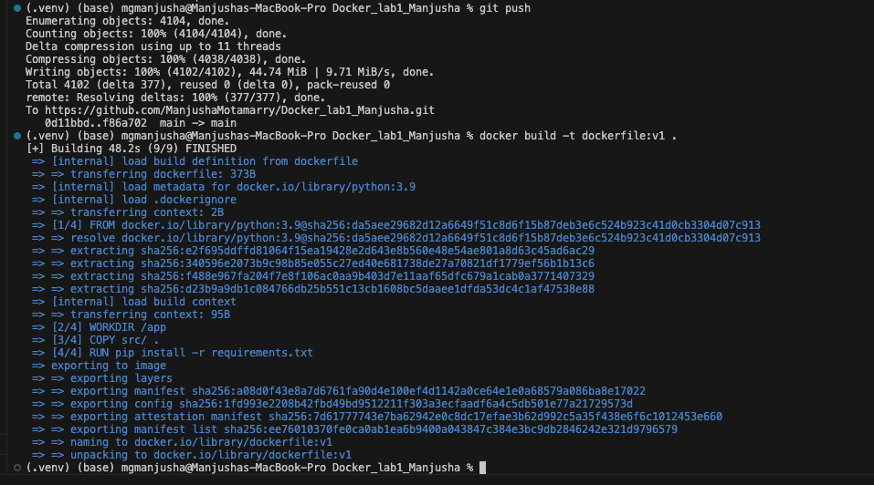
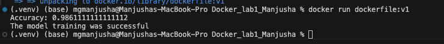

# Lab: Digits Classification with Docker

## Project Structure
```

Lab/
├── src/
│    └── main.py          # Trains the SVM model and saves digits_model.pkl
├── requirements.txt      # Python dependencies
├── screenshots/
│    ├── docker_build.png # Screenshot of docker build output
│    └── docker_run.png   # Screenshot of docker run output
└── Dockerfile            # Image build instructions

```


## How to Build the Docker Image
docker build -t digits-lab:v1 .


## How to Run the Container
docker run --rm digits-lab:v1



## What It Does
- Loads the sklearn digits dataset  
- Trains an SVM (RBF) classifier  
- Saves the trained model as digits_model.pkl  
- Prints: "The model training was successful"
